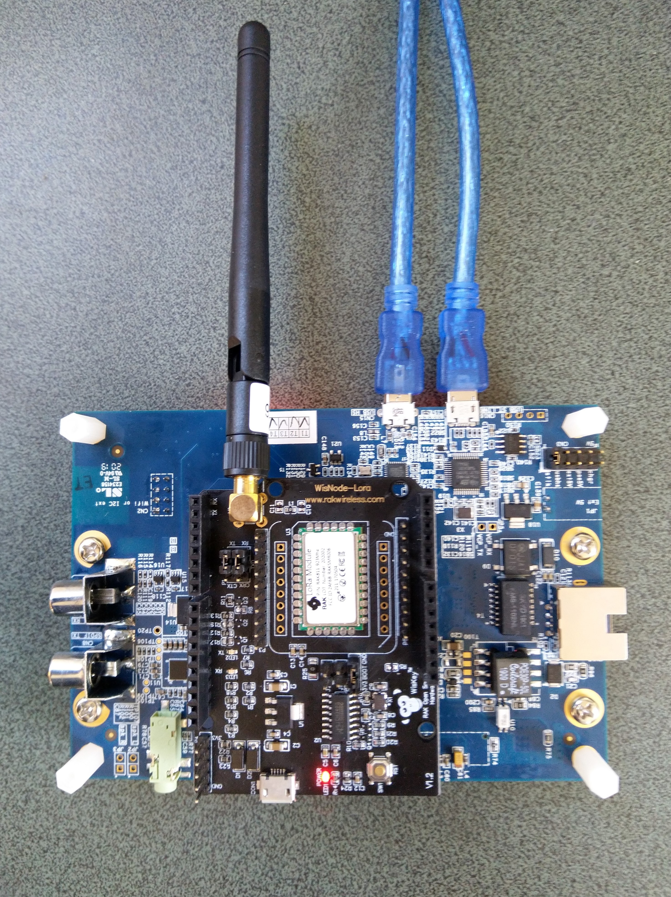

# RAK811LoRaWAN-NetNF
A C# library for [LoRaAlliance LoRaWAN](https://lora-alliance.org/about-lorawan) connectivity for [RAKwireless](https://www.rakwireless.com/en-us) [RAK811 Module](https://store.rakwireless.com/products/rak811-lpwan-module) equipped [.Net nanoFramework](https://nanoframework.net/) powered devices.

The repo has the source code for the series of blog posts written as I built this library

01. [ShieldSerial](http://blog.devmobile.co.nz/2020/06/15/nanoframework-rak811-lorawan-library-part1/)
02.

